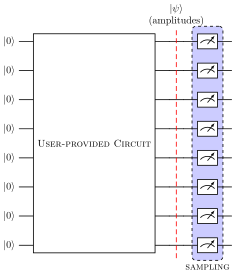

##############
Basic Concepts
##############

This section provides an overview of how the circuit simulation works in our
framework.

Quantum Circuit
===============

A quantum circuit is a sequence of quantum gates and operations acting on
qubits, the basic units of quantum information.

Every computation, in MIMIQ Circuits starts with the construction of a quantum
circuit. You can construct the circuit using the tools provided by the
"MimiqCircuits" library, including gates and various quantum operations. Once
you have built the circuit, you can proceed with the simulation.

A simple circuit with 4 Hadamard gates on 4 different qubits is given by

>>> c = Circuit()
>>> c
empty circuit
>>> for i in range(4):
>>>     c.push(GateH(), i)
>>>
>>> c
4-qubit circuit with 4 gates
 ├── H @ q0
 ├── H @ q1
 ├── H @ q2
 └── H @ q3

or simply

>>> c.push(GateH(), *range(4))
>>> c
4-qubit circuit with 4 gates
 ├── H @ q0
 ├── H @ q1
 ├── H @ q2
 └── H @ q3

We are using a `@` notation to indicates that a quantum operation, in this case
a Hadamard gate `H`, is applied to one or many qubits. Hadamard gates are single
qubit gates, so they can be applied only to one qubit at a time (e.g. `H @ q0`
in the example). In this notation we indicate with `q0, q1, q2...` qubits or
quantum bit targets and with `c0, c1, c2, ...` classical bit targets.

.. note::

    Indexing of targets is different between Julia and Python. Julia indices
    starts from 1, while Python indices start from 0. Pay extra attention when
    translating code from Python or to Julia and vice versa (e.g. when
    importing code from other frameworks).

Quantum circuits can be easily manipulated in `MimiqCircuits`. Some common
operations include:

* Adding gates or quantum operations (e.g. with `circuit.add_gate(gate,
  target_qubits)`),

>>> c = Circuit()
>>> c
empty circuit
>>> c.push(GateX(), 0)
>>> c
1-qubit circuit with 1 gates
 └── X @ q0
>>> c.push(GateCX(), 0, 1)
>>> c
2-qubit circuit with 2 gates
 ├── X @ q0
 └── CX @ q0, q1
>>> c.push(Barrier(2), 0, 1)
>>> c
2-qubit circuit with 3 gates
 ├── X @ q0
 ├── CX @ q0, q1
 └── Barrier @ q0, q1
>>> c.push(GateCX(), 1, 0)
>>> c
2-qubit circuit with 4 gates
 ├── X @ q0
 ├── CX @ q0, q1
 ├── Barrier @ q0, q1
 └── CX @ q1, q0

* Taking the inverse of a circuit or any other object (with `object.inverse()`)

>>> c
2-qubit circuit with 4 gates
 ├── H @ q0
 ├── H @ q1
 ├── CRX(theta=0.7853981633974483) @ q0, q1
 └── S @ q1
>>> c.inverse()
2-qubit circuit with 4 gates
 ├── SDG @ q1
 ├── CRX(theta=-0.7853981633974483) @ q0, q1
 ├── H @ q1
 └── H @ q0

* Appending a circuit to another (with `circuit.append(circuit_to_append)`)

>>> c
4-qubit circuit with 4 gates
 ├── H @ q0
 ├── H @ q1
 ├── H @ q2
 └── H @ q3
>>> c2
4-qubit circuit with 3 gates
 ├── CX @ q0, q1
 ├── CX @ q1, q2
 └── CX @ q2, q3
>>> c.append(c2)
>>> c
4-qubit circuit with 7 gates
 ├── H @ q0
 ├── H @ q1
 ├── H @ q2
 ├── H @ q3
 ├── CX @ q0, q1
 ├── CX @ q1, q2
 └── CX @ q2, q3

Bit States
==========

We define *bit states* as the computational states of a multi qubit system in
which each qubit state is determined. These states are often indicated by the
notation

.. math::

    \ket{01001010\cdots} \equiv \ket{0}\ket{1}\ket{0}\ket{0}\ket{1}\ket{0}\ket{1}\ket{0}\cdots.

Each bit state is fully specified a string of zeros and ones, and hence they
are sometimes also referred to as "bitstrings".

The set of all the possible bit states form an complete and orthogonal basis for
the quantum state of a multiqubit system, meaning that an arbitrary quantum state of
such system can be written as a sum over *bit states* with complex coefficients. 
For example, for a 2 qubit system:

.. math::
   :nowrap:

    \ket{\psi} =
    c_0 \ket{00} + c_1 \ket{10} + c_2 \ket{01} + c_3 \ket{11}
    \qquad
    \forall c_0, c_1, c_2, c_3, \sum_0^3 c_i^2 = 1.

`MimiqCircuits` provides users with a set of utilities to handle, construct and
manipulate bit states. 

Few things you can do with `BitState`:

* Create a bit state for a :math`N`-qubit system (:math:`N=4` in the example)

>>> x = BitState.zeros(4)
>>> x
BitState('0000')
>>> print(x)
4-qubit BitState:
└── |0000⟩

* Create a bit state from a list of nonzero qubits, or from an integer
  (converting from its binary representation)

>>> BitState.fromnonzeros(10, [1,3,8])
BitState('0101000010')
>>> BitState.fromint(10, 5)
BitState('1010000000')

* Create a bit state using a generator function (lambda function in this case):

>>> BitState.fromfunction(10, lambda i: i % 2 == 0)
BitState('1010101010')

* Convert a BitState to a string or integer

>>> bs = BitState.fromint(10, 534)
>>> bs.to01()
'0110100001'
>>> bs.tointeger()
534

* Get the state of each qubit, the list of nonzero qubits, or even iterate over the qubits

>>> bs[9]
1
>>> bs.nonzeros()
[1, 2, 4, 9]
>>> for i in bs:
...     print(i)
... 
0
1
1
0
1
0
0
0
0
1

Besides accessing the quantum state amplitudes corresponding to different bit states,
with MIMIQ Circuits, you also have the flexibility to sample the final state in much
the same way as is the case for a real quantum computer. 

Executing the Circuit
=====================

The simulation of a circuit is then performed via the `execute` function, which
start a remote job on the MIMIQ Remote Services. When a job is completed,
results can be retrieved by the `get_results` function. Upon execution, you can
specify the algorithm used in the simulation, the number of samples to be
performed or the bit states for which the amplitudes should be computed.

A simulation performs the computation

.. math::
    \ket{\psi} = U \ket{000\cdots}

The starting state is always the one where all the qubits are in the
:math:`\ket{0}` state. After the circuit execution, the final state
:math:`\ket{\psi}` is used for extracting amplitudes and for sampling.

Below we show a graphical representation of the circuit execution.

Sampling
========

Sampling is performed by applying a measurements operation to the final state
on each and every qubit. With MIMIQ Circuits many samples can be obtained very
efficiently without necessarily recomputing the whole circuit. The number of
samples to obtain is specified through the `samples` keyword argument when
executing a job.

.. note::

    The maximum number of samples a user can request is of `2^16`

Amplitudes
==========

Amplitudes corresponding to the bit states specified when submitting a
simulation, are computed just before the sampling process, right after having
applied the circuit provided by the user.

Classical Registries and Mid-Circuit Measurements
=================================================

At present, MIMIQ Circuits does not support classical registers or measurements
in the middle of the circuit. However, we are continuously working to enhance
our framework with the plan to introduce these features in a coming update.

