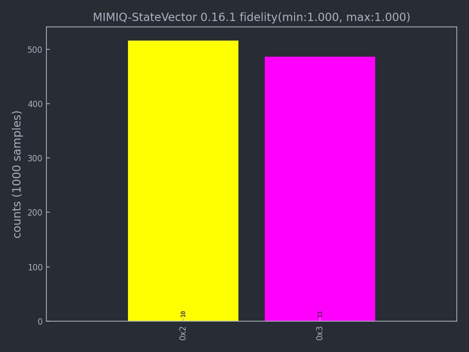

Import and export circuits
==============================

.. doctest:: import_export

    from mimiqcircuits import *

In this section we introduce different options to import and export circuits.
In particular, MIMIQ allows to import circuits in well-known languages such as OpenQASM and Stim, as well as save and import circuits using its own Protobuf structure.

Protobuf
-----------------

Export Protobuf files from MIMIQ
~~~~~~~~~~~~~~~~~~~~~~~~~~~~~~~~

After building a circuit in MIMIQ you can export it into a Protobuf format using the :func:`~mimiqcircuits.Circuit.saveproto` function. You need to give it two arguments, the name of the file to create (`.pb` format) and the circuit to save.

.. doctest:: import_export

    results.saveproto("my_circuit.pb")

The same method allows you to save your simulation results in a Protobuf file.

.. doctest:: import_export

    # get the results
    results = conn.get_results(job)
    # save the results
    results.saveproto("my_results.pb")

.. note::

    Protobuf is a serialized file format developed by google. It is very lightweight and efficient to parse. Check the  `Protobuf repository <https://github.com/protocolbuffers/protobuf>`_` for more information.

.. note::

    You can only export a circuit into Protobuf format and cannot export an OpenQASM or Stim file in the current version of MIMIQ.

Import Protobuf file to MIMIQ
~~~~~~~~~~~~~~~~~~~~~~~~~~~~~~

MIMIQ allows you to import Protobuf circuit files using the :func:`~mimiqcircuits.Circuit.loadproto` function and import Protobuf results file using :func:`~mimiqcircuits.QCSResults.loadproto`.
With this function you can get previously saved circuit or get previous simulation results.
You need to give this function the name of the file to parse and the type of object to parse.

.. doctest:: import_export

    # Import circuit from Protobuf to MIMIQ
    circuit = Circuit.loadproto("my_circuit.pb")

    # Import results from Protobuf to MIMIQ
    results = QCSResults.loadproto("my_results.pb")

The circuit imported with :meth:`~mimiqcircuits.Circuit.loadproto` can be manipulated like any other circuit on MIMIQ to add or insert gates, see :doc:`circuit <circuits>` page.

OpenQASM
-----------------

Open Quantum Assembly Language is a programming language designed for describing quantum circuits and algorithms for execution on quantum computers. It is a very convenient middle ground for different quantum computer architectures to interpret and execute circuits.

Execute OpenQASM file in MIMIQ
~~~~~~~~~~~~~~~~~~~~~~~~~~~~~~~~

The remote MIMIQ services can readily process and execute OpenQASM files, thanks to fast and feature-complete Julia and C++ parsers and interpreters.

Here is a simple comprehensive example of executing a QASM file on MIMIQ.

.. doctest:: import_export
    :hide:

    >>> from mimiqcircuits import *
    >>> import os
    >>> conn = MimiqConnection(QPERFECT_CLOUD2)
    >>> conn.connect(os.getenv("MIMIQUSER"), os.getenv("MIMIQPASS"))
    Connection:
    ├── url: https://mimiqfast.qperfect.io/api
    ├── Computing time: 598/10000 minutes
    ├── Executions: 594/10000
    ├── Max time limit per request: 180 minutes
    └── status: open
    <BLANKLINE>

.. doctest:: import_export

    >>> qasm = """
    ... // Implementation of Deutsch algorithm with two qubits for f(x)=x
    ... // taken from https://github.com/pnnl/QASMBench/blob/master/small/deutsch_n2/deutsch_n2.qasm
    ... OPENQASM 2.0;
    ... include "qelib1.inc";
    ... qreg q[2];
    ... creg c[2];
    ... x q[1];
    ... h q[0];
    ... h q[1];
    ... cx q[0],q[1];
    ... h q[0];
    ... measure q[0] -> c[0];
    ... measure q[1] -> c[1];
    ... """

    # Write the OPENQASM as a file
    >>> with open("/tmp/deutsch_n2.qasm", "w") as file:
    ...     file.write(qasm)
    308

    # actual execution of the QASM file
    >>> job = conn.execute("/tmp/deutsch_n2.qasm", algorithm="statevector")
    >>> res = conn.get_result(job)
    >>> res.histogram()
    {frozenbitarray('10'): 530, frozenbitarray('11'): 470}
    >>> from mimiqcircuits.visualization import *

    # Visualizing the result
    >>> plothistogram(res)
    <Figure size 960x720 with 1 Axes>

The result will be plotted as follows:

For more informations, read the documentation of :meth:`~mimiqcircuits.MimiqConnection.execute`.

Behaviour of include files
^^^^^^^^^^^^^^^^^^^^^^^^^^

A common file used by many QASM files is the `qelib1.inc` file.
This file is not defined as being part of OpenQASM 2.0, but its usage is so widespread that it might be considered as de-facto part of the specifications.

.. admonition:: details

    We remind the careful reader that OpenQASM 2.0 specifications only define 6 operations:
    `U`, `CX`, `measure`, `reset`, `barrier` and `if`.

If we were to parse every file together with `qelib1.inc`, we would have at the end just a list of simple `U` and `CX` gates, leaving behind any speed improvement that we would gain by using more complex gates as blocks. For this reason, if you don't explicitly provide the include files, MIMIQ will not parse the usual `qelib1.inc` file but will instead use a simplified version of it, where almost all gate definitions are replaced by `opaque` definitions. These opaque definitions will be converted to the corresponding MIMIQ gates listed in :meth:`~mimiqcircuits.Circuit.`GATES``.

Another alternative is to use the `mimiqlib.inc` directly in your file. For now it's almost a copy of the modified `qelib1.inc` but in the future it will be extended to contain more gates and operations, diverging from `qelib1.inc`.

Parse OpenQASM locally
~~~~~~~~~~~~~~~~~~~~~~

You can parse OpenQASM 2.0 code directly into a MIMIQ :class:`~mimiqcircuits.Circuit` object using the :mod:`mimiqcircuits.qasm` module. This is useful for importing circuits from other tools, analyzing them, or modifying them before execution.

The parsing process involves two steps:

1.  **Parsing**: Converts the QASM source (string) into an Abstract Syntax Tree (AST) using :func:`~mimiqcircuits.qasm.loads` or :func:`~mimiqcircuits.qasm.load`.
2.  **Interpretation**: Converts the AST into a :class:`~mimiqcircuits.Circuit`.

.. doctest:: import_export

    >>> from mimiqcircuits.qasm import loads
    >>> qasm_source = """
    ... OPENQASM 2.0;
    ... include "qelib1.inc";
    ... qreg q[2];
    ... h q[0];
    ... cx q[0], q[1];
    ... """
    >>> circuit = loads(qasm_source)
    >>> print(f"Circuit with {circuit.num_qubits()} qubits") # compact print for doctest
    Circuit with 2 qubits

You can also load directly from a file:

.. code-block:: python

    from mimiqcircuits.qasm import load
    circuit = load("my_circuit.qasm")

Export to OpenQASM
~~~~~~~~~~~~~~~~~~

Any MIMIQ :class:`~mimiqcircuits.Circuit` can be exported back to OpenQASM 2.0 format. This supports standard gates as well as custom gate definitions.

* :func:`~mimiqcircuits.qasm.dumps`: Returns the QASM representation of the circuit as a string.
* :func:`~mimiqcircuits.qasm.dump`: Writes the QASM representation directly to a file.

.. doctest:: import_export

    >>> from mimiqcircuits.qasm import dumps
    >>> qasm_out = dumps(circuit)
    >>> print(qasm_out)
    OPENQASM 2.0;
    include "qelib1.inc";
    qreg q[2];
    creg c[0];
    h q[0];
    cx q[0],q[1];
    <BLANKLINE>

Relations between OpenQASM registers and MIMIQ indices
------------------------------------------------------

During the parsing of the QASM file, we will assign a unique index to each qubit
and classical bit. This index will be used to identify the qubit or bit in the
MIMIQ-CIRC service.

The indices are assigned in the following way:

- The first qubit is assigned index `0` (Python), the second `1`, and so on.
- All registers retain the same ordering as in the QASM file.
- Qubits and classical bits behave similarly but have they have each other its
  own sequence from indices, starting from `0`.

A simple example will clarify this behaviour:

.. code::

    OPENQASM 2.0;
    qreg q[2];
    creg m[10];
    qreg a[10];
    creg g[2];

Will be parsed as:

========= ================= ===============
QASM name MIMIQ Qubit index MIMIQ Bit index
========= ================= ===============
``q[0]``  ``0``
``q[1]``  ``1``
``a[0]``  ``2``
``a[1]``  ``3``
``...``   ``...``           ``...``
``a[9]``  ``11``
``m[0]``                    ``0``
``m[1]``                    ``1``
``...``   ``...``           ``...``
``m[9]``                    ``0``
``g[0]``                    ``10``
``g[1]``                    ``11``
========= ================= ===============

Stim
----

Execute Stim file on MIMIQ
~~~~~~~~~~~~~~~~~~~~~~~~~~

`Stim <https://github.com/quantumlib/Stim>`_ is a fast stabilizer circuit simulator commonly used for Clifford circuit simulation. Stim allows users to export their circuit to a text format usually with the `.stim` extention.
The remote MIMIQ services can readily process and execute Stim files as follows:

.. doctest:: import_export

    job = conn.execute("my_stim_circuit.stim")

.. warning::

    The support of Stim is still in progress and some of the most specific Stim features are not supported. For instance, detectors will be completely ignored by MIMIQ at exectution time.

The results of the simulation can be accessed as usual on MIMIQ, see :doc:`remote execution <remote_execution>` page.

Reference
---------

.. autofunction:: mimiqcircuits.Circuit.saveproto
    :noindex:
.. autofunction:: mimiqcircuits.Circuit.loadproto
    :noindex:
.. autofunction:: mimiqcircuits.QCSResults.saveproto
    :noindex:
.. autofunction:: mimiqcircuits.QCSResults.loadproto
    :noindex:
.. autofunction:: mimiqcircuits.qasm.load
    :noindex:
.. autofunction:: mimiqcircuits.qasm.loads
    :noindex:
.. autofunction:: mimiqcircuits.qasm.dump
    :noindex:
.. autofunction:: mimiqcircuits.qasm.dumps
    :noindex:
