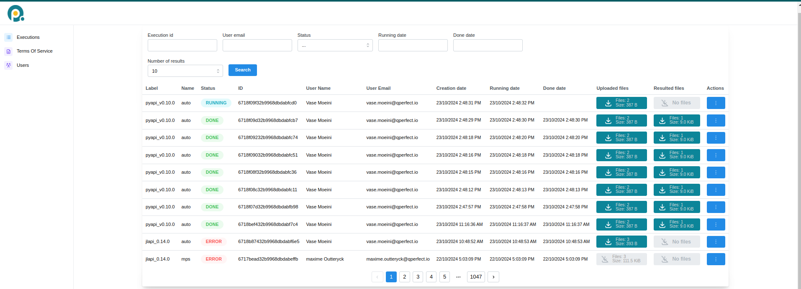

Execution on MIMIQ
==================
This page provides detailed information on how to execute quantum circuits on MIMIQ's remote services.

Cloud Service
-------------
.. _cloud-service:

MIMIQ provides remote execution of quantum circuits via its cloud services, allowing users to run quantum 
jobs on high-performance infrastructure. You can connect to the cloud server by providing your credentials and accessing the MIMIQ cloud 
URL at [https://mimiq.qperfect.io/sign-in].

Overview
~~~~~~~~
.. _overview:

The MIMIQ Cloud Service offers multiple features for managing job executions, 
user roles, and organizational access. Below is a screenshot of the **Cloud Dashboard** that you will find in the server website.

Job Management
~~~~~~~~~~~~~~
.. _job-management:

The Job Management or Executions section provides a comprehensive view of all 
quantum jobs submitted. Users can track the status of their jobs, cancel jobs, retrieve results and view detailed information, including start time, completion time, and current status. For **Organization Managers**, additional features are available:

- View Other Users' Jobs: Organization managers can view jobs submitted by all users in their organization, allowing them to monitor the workload.

- Cancel Jobs: Managers also have the ability to cancel any job within their organization if necessary, providing greater control over resource management.
  
This section is essential for both tracking the progress of jobs and managing computational resources effectively.

**Job status**

The Status tab allows you to filter jobs based on their status. By clicking on the tab, you can select a specific status (e.g., NEW), and then click on the Search button to view all jobs that match the selected status.

When a job is submitted to the MIMIQ cloud services, it goes through various status stages:

  - `NEW`: When a job is initially submitted, its status is marked as NEW, indicating that it has entered the queue but has not started executing yet. In this stage, the job is waiting for previous jobs in the queue to complete, whether they finish successfully or encounter errors.

  - `RUNNING`: Once all prior jobs are completed, your job will begin execution, and its status will change to RUNNING. At this point, the job is actively being processed by the MIMIQ engine, either by the statevector simulator or MPS algorithm, depending on the job configuration.

  - `DONE`: Upon successful completion, the job status changes to DONE, indicating that the quantum circuit has finished executing and the results are available for retrieval.

  - `ERROR`: If the job encounters an issue during execution, such as exceeding the time limit or encountering hardware or software errors, its status will change to ERROR. Users can then review the error logs to diagnose the problem. You can also hover your mouse over the word `ERROR` and a short error message will appear.

**ID**

The ID tab shows a unique identifier for each job. This identifier can be used to retrieve results using [:meth:`~mimiqcircuits.MimiqConnection.get_results`], See :ref:`Results <results>` section for more details.

Terms of Service
~~~~~~~~~~~~~~~~~
.. _terms-of-service:

When an Organization Manager first connects to the server they need to accept the `Terms of Service` in order to activate the cloud subscription. The organization users will then be able to send jobs. The Terms of Service is also available for the users to read it.

User Management
~~~~~~~~~~~~~~~
.. _user-management:

The User Management section is available exclusively to users with the Organization Manager role.

Key features of user management include:

- Adding New Users: Organization managers can invite new users to join their organization, enabling them to submit jobs. However, there is a limit to how many users can be added based on the organization’s plan.
- Role Management: Organization managers can assign roles and manage permissions within their team, ensuring that the right users have the necessary access to cloud resources.

Connecting to server for sending jobs
-------------------------------------
.. _connecting-to-server:

In order to execute a circuit in the remote, you first need to connect to it, see also :doc:`quickstart </quick_start>` page.

Credentials
~~~~~~~~~~~
.. _credentials:

You can connect to the MIMIQ server using the [:meth:`~mimiqcircuits.MimiqConnection.connect`] method and providing your credentials (username and password). If you do not supply your credentials directly in the function call, you will be redirected to a localhost page where you can securely enter your credentials. This method is preferred for better security, as it avoids storing your username and password in the script.

**Example**:

.. code-block:: python

    
    conn = MimiqConnection(url = QPERFECT_CLOUD)

    conn.connect("username", "password")

Tokens
~~~~~~
.. _tokens:

Instead of using your credentials every time you connect to the MIMIQ services, you can authenticate once and save a token. This token can be saved to a JSON file and reused across different sessions, making it a secure and efficient way to manage authentication.

**How Token Authentication Works**:

- First Authentication: You log in once using your credentials (via browser or directly), and the token is generated.

- Saving the Token: You can save this token in a JSON file using the savetoken method.

- Loading the Token: Later, you can load the saved token with the loadtoken method to reconnect without providing your credentials again.

This is a safer method, as it avoids hardcoding sensitive information like passwords in your scripts.

After authentication, this is how it looks:

.. code-block:: python

    # Save the token to a file (example_token.json)
    conn.savetoken("example_token.json")

    # Load the token from a saved file to reconnect
    conn.loadtoken("example_token.json")
    

You can also accomplish all at once (connecting through a token if possible, otherwise connecting via the browser and then saving the token) using this code block:

.. code-block:: python

    conn = MimiqConnection(QPERFECT_CLOUD)

    try:
        conn = conn.loadtoken()
    except Exception:
        conn.savetoken()
        conn = conn.loadtoken()

    
.. Note::
      Tokens stay valid only for one day.

Execution
---------
.. _execution:

MIMIQ supports sending quantum circuits to its remote services for execution, either as a **single circuit** or in **batch mode** (i.e., multiple circuits at once). In both cases, circuits are initialized in the zero state, and results are obtained by running the circuit and sampling.

You can submit one or multiple circuits for execution using the :meth:`~mimiqcircuits.MimiqConnection.submit` method. This unified interface simplifies quantum job management, whether you're running a single job or a batch of jobs.

**Parameters**:

- **circuits**: A single quantum circuit or a list of circuits. These can be provided as MIMIQ :class:`~mimiqcircuits.Circuit` objects or as paths to valid `.pb`, `.qasm`, or `.stim` files. See the :doc:`Import and Export <import_export>` and :doc:`Circuits <circuits>` pages for more details.

- **kwargs...**: Additional options to customize execution:

  - **label**: A descriptive name for the simulation or batch (default: `"pyapi_v<version>"`).

  - **algorithm**: The backend method to perform the simulation. Options are `"auto"`, `"statevector"`, or `"mps"`. The default is `"auto"`, which selects the most appropriate method based on the circuit. See the :doc:`Simulation <simulation>` page for more information.

  - **nsamples**: Number of measurement samples to generate (default: 1000, maximum: 65536). See :doc:`Simulation <simulation>` for details on sampling.

  - **bitstrings**: A list of bitstrings to compute amplitudes for. This is equivalent to adding an :class:`~mimiqcircuits.Amplitude` operation at the end of the circuit. Results will be stored in the Z-register. See the :doc:`Amplitudes <statistical_ops>` section for more details.

  - **timelimit**: Maximum execution time in minutes (default: 30).

  - **bonddim**: Bond dimension for MPS simulations (default: 256). See the :doc:`Simulation <simulation>` page.

  - **entdim**: Entangling dimension for MPS simulations (default: 16). See the :doc:`Simulation <simulation>` page.

  - **seed**: Seed for the random number generator.

  - **simulation parameters**: See :doc:`Simulation Parameters <simulation_parameters>` page for more details on advanced simulation parameters like `mpsmethod` and `traversal`.

  **Noisy Simulation**:

  To run a noisy simulation, you can pass a :class:`~mimiqcircuits.NoiseModel` object to the `noisemodel` parameter.
  This model will be applied to the circuit(s) locally before execution.

  .. code-block:: python

      nm = NoiseModel()
      nm.add_readout_noise(ReadoutErr(0.01, 0.02))
      conn.submit(c, noisemodel=nm)

  **Return type: Jobs**:

  **Return type: Jobs**:

It is important to note that the :meth:`~mimiqcircuits.MimiqConnection.submit` method. 
returns an `execution ID` (a unique string). 
This ID represents the submitted job and can be used in subsequent calls to 
retrieve results or check the job status. For example, 
you can use the `execution_ID` with methods 
like :meth:`~mimiqcircuits.MimiqConnection.get_results` 
or :meth:`~mimiqcircuits.MimiqConnection.get_result` 
to retrieve the results of your quantum job or status updates 
(see :ref:`Results <results>` and :ref:`Job-Management <job-management>` sections).
However, if for some reason you lose access to 
this object or want to connect to the same job in a different session, 
you can do so using its job ID:

.. code-block:: python

   job = "job-id"

Here, `"job-id"` is the unique identifier of the job, which you can find in the dashboard of the web interface (see :ref:`cloud-service <cloud-service>` section).

.. doctest:: Execute
    :hide:

    >>> from mimiqcircuits import *
    >>> import os
    >>> conn = MimiqConnection(QPERFECT_CLOUD)
    >>> conn.connect(os.getenv("MIMIQUSER"), os.getenv("MIMIQPASS"))
    MimiqConnection:
    ├── url: https://mimiq.qperfect.io
    ├── Max time limit per request: 360 minutes
    ├── Default time limit is equal to max time limit: 360 minutes
    └── status: open

    
.. doctest:: Execute

    # Prepare circuits
    >>> c1 = Circuit()
    >>> c2 = Circuit()

    # Add gates to the circuits
    >>> c1.push(GateX(), 1)
    2-qubit circuit with 1 instructions:
    └── X @ q[1]
    <BLANKLINE>

    >>> c2.push(GateH(), 2)
    3-qubit circuit with 1 instructions:
    └── H @ q[2]
    <BLANKLINE>

    # Execute Single circuit
    >>> job_single = conn.submit(c1, nsamples=1000, label="Single_run")
    >>> job_single
    '6891b4c2e9ed81e0cb891c0d'

    # Execute circuits in batch mode
    >>> job_batch = conn.submit([c1, c2], nsamples=1000, label="batch_run")
    >>> job_batch
    '673900471aa1b0ea6ef1fd82'

Results
-------
.. _results:

After submitting executions, you can retrieve your simulation 
results in two different ways: through the cloud server, 
or from your Python session.

.. Warning::
    The job results will be deleted from the remote server after some time, 
    so make sure to retrieve them in time. Contact your organization manager 
    to understand how long results will be stored in the server. Note also that 
    results will be deleted after a 
    shorter period of time once the user has downloaded them at least once.

Getting results (Cloud server)
~~~~~~~~~~~~~~~~~~~~~~~~~~~~~~
.. _getting-results-cloud:

You can download results directly from the cloud server web interface by clicking the box 
under the *Resulted files* tab, see :ref:`cloud server <cloud-service>` section. 
This will download a Protobuf file (`.pb`) and save it locally. 
The results can then be loaded to your Python session using 
the :meth:`~mimiqcircuits.QCSResults.loadproto` function. 

To learn more about Protobuf and how to save/load results, 
check out the :doc:`import & export <import_export>` page, 
and the :ref:`saving and loading results <saving-and-loading-results>` section.

Getting results (Python session)
~~~~~~~~~~~~~~~~~~~~~~~~~~~~~~~~
.. _getting-results-puthon:

You can download results from your Python session by calling these two methods :meth:`~mimiqcircuits.MimiqConnection.get_results` and 
:meth:`~mimiqcircuits.MimiqConnection.get_result` which like `~mimiqcircuits.MimiqConnection.submit` method belong to the :class:`~mimiqcircuits.MimiqConnection` class. 

The only difference between the two is that `get_results` retrieves the 
results of *all* the circuits sent in a job, whereas `get_result` 
only returns the result of the first circuit making it a more lightweight version. 
This is useful if you want to peek at the results before all circuits of a given job have finished. 
(If only one circuit was sent then there's no difference.)

They are both called in a similar way as `connection.get_results(execution_id, **kwargs)`.

**Parameters:**

  - `execution (Execution)`: The execution object representing the job whose results are to be fetched, see :ref:`execution <execution>` section. If you saved the output of `submit` then you can pass it to `get_results` (see example below). If you didn't save it, then you can copy the job ID from the Cloud server (see :ref:`cloud-service <cloud-service>` section) and pass it to `get_results` as `"job-id"`.
  - `interval (Int)`: Time interval in seconds between calls to the remote to check for job completion (default: 1 second). A shorter interval results in more frequent checks, while a longer interval reduces the frequency of status checks, saving computational resources.

.. warning::
    Both `get_results` and `get_result` block further code execution until the job 
    requested has finished. If you want to check the status of the job before attempting to retrieve results, 
    we recommend using [:meth:`~mimiqcircuits.MimiqConnection.isJobDone`], see :ref:`job management <useful-job-management-features>` section.

.. note::
    `get_result` internally calls `get_results` but only returns the first result if multiple results are retrieved.

**Example**:

.. doctest:: Execute

    # Getting the Results
    >>> res_single = conn.get_result(job_single)
    >>> res_single
    QCSResults:
    ├── simulator: MIMIQ-MPS 0.18.3
    ├── timings:
    │    ├── compression time: 0.000519923s
    │    ├── apply time: 0.002742807s
    │    ├── parse time: 0.000903225s
    │    ├── sample time: 0.002097291s
    │    ├── amplitudes time: 1.55e-07s
    │    └── total time: 0.0068613139999999994s
    ├── fidelity estimate: 1
    ├── average multi-qubit gate error estimate: 0
    ├── most sampled:
    │    └── bs"01" => 1000
    ├── 1 executions
    ├── 0 amplitudes
    └── 1000 samples

    >>> res_batch = conn.get_results(job_batch)
    >>> res_batch
    [QCSResults:
    ├── simulator: MIMIQ-StateVector 0.18.0
    ├── timings:
    │    ├── parse time: 0.000111029s
    │    ├── apply time: 3.3254e-05s
    │    ├── total time: 0.000376924s
    │    ├── amplitudes time: 1.42e-07s
    │    ├── compression time: 6.48e-06s
    │    └── sample time: 0.000115204s
    ├── fidelity estimate: 1
    ├── average multi-qubit gate error estimate: 0
    ├── most sampled:
    │    └── bs"01" => 1000
    ├── 1 executions
    ├── 0 amplitudes
    └── 1000 samples, QCSResults:
    ├── simulator: MIMIQ-StateVector 0.18.0
    ├── timings:
    │    ├── parse time: 6.7155e-05s
    │    ├── apply time: 2.2546e-05s
    │    ├── total time: 0.000307035s
    │    ├── amplitudes time: 1.03e-07s
    │    ├── compression time: 5.19e-06s
    │    └── sample time: 0.000127987s
    ├── fidelity estimate: 1
    ├── average multi-qubit gate error estimate: 0
    ├── most sampled:
    │    ├── bs"000" => 520
    │    └── bs"001" => 480
    ├── 1 executions
    ├── 0 amplitudes
    └── 1000 samples]

Format of Results
~~~~~~~~~~~~~~~~~
.. _format-of-results:

When you retrieve jobs results, you will get back 
a [:class:`~mimiqcircuits.QCSResults`] object (when using `get_result`) or 
a `Vector{QCSResults}` (when using `get_results`). Each `QCSResults` 
object contains information about job executed. 
You can get an overview by printing it:

.. code-block::

    QCSResults:
    ├── simulator: MIMIQ-StateVector 0.18.0
    ├── timings:
    │    ├── parse time: 5.1514e-05s
    │    ├── apply time: 1.8876e-05s
    │    ├── total time: 0.00019858s
    │    ├── amplitudes time: 1.05e-07s
    │    ├── compression time: 4.5e-06s
    │    └── sample time: 5.9246e-05s
    ├── fidelity estimate: 1
    ├── average multi-qubit gate error estimate: 0
    ├── most sampled:
    │    └── bs"01" => 1000
    ├── 1 executions
    ├── 0 amplitudes
    └── 1000 samples

The [:class:`~mimiqcircuits.QCSResults`] object has different fields that you can access:

**Key fields:**

- **simulator** (`String`): Name of the simulator used, e.g., `MIMIQ-StateVector`.

- **version** (`String`): Version of the simulator used, e.g. `0.14.1`.

- **fidelities** (`Vector{Float64}`): Fidelity estimates for each of the circuits executed (between 0 and 1).

- **avggateerrors** (`Vector{Float64}`): Average multiqubit gate errors. This value represents the average fidelity that multi-qubit gates would need to have in a real quantum computer in order to yield the same fidelity as the MIMIQ simulation.

- **cstates** (`Vector{BitString}`): Vector with the sampled values of the classical registers, i.e. of measurements. See [:doc:`circuits </manual/circuits>`] and [:doc:`non-unitary operations </manual/non_unitary_ops>`] pages.

- **zstates** (`Vector{ComplexF64}`): Vector with the values of the Z-registers, i.e. of expectation values, entanglement measures, etc. See [circuit](circuits.md) and [statistical operations](statistical_ops.md) pages.

- **amplitudes** (`Dict{BitString, ComplexF64}`): Number of amplitudes retrieved.

- **timings** (`Dict{String, Float64}`): Time taken for different stages of the execution. You can access:

  - **"total"** (`Float64`): The entire time elapsed during execution.

  - **"parse"** (`Float64`): Time taken to parse the circuit.

  - **"compression"** (`Float64`): Time to convert the circuit to an efficient execution format.

  - **"apply"** (`Float64`): Time to apply all operations. It also includes the time to allocate the initial state.

..  note::

    To understand how MIMIQ samples measurements into the classical register, check the [:doc:`simulation </manual/simulation>`] page.

Here's an example of how to access different fields:

**Example**:

.. doctest:: Execute

    # Get fidelity
    >>> fids = res_single.fidelities
    >>> print(fids)
    [1.0]
    
    # Get total execution time
    >>> tot = res_single.timings["total"]
    >>> print(tot)
    0.0068613139999999994

    # Get classical registers of the first 10 samples
    >>> first_samples = res_single.cstates[0:10]
    >>> print(first_samples)
    [frozenbitarray('01'), frozenbitarray('01'), frozenbitarray('01'), frozenbitarray('01'), frozenbitarray('01'), frozenbitarray('01'), frozenbitarray('01'), frozenbitarray('01'), frozenbitarray('01'), frozenbitarray('01')]

With the output of [:meth:`~mimiqcircuits.MimiqConnection.get_results`]it works the same way,
except you have to access one of the circuit results, i.e. `res_batch[index]` 
instead of `res_single`.

Plotting results
~~~~~~~~~~~~~~~~~
.. _plotting-results:

You can visualize the results of your circuit execution by importing the :meth:`~mimiqcircuits.plothistogram` method. 
The example below shows how to plot the results from executing a single circuit.

**Example**:

.. doctest:: Execute

    >>> from mimiqcircuits.visualization import plothistogram
    >>> plothistogram(res_single)
    <Figure size 960x720 with 1 Axes>
    

Saving and loading results
~~~~~~~~~~~~~~~~~~~~~~~~~~~
.. _saving-and-loading-results:

After retrieval, if you want to save the results locally, you can save them as a 
Protobuf file (`.pb`) using the [:meth:`~mimiqcircuits.QCSResults.saveproto`] method. You can load back the results 
using [:meth:`~mimiqcircuits.QCSResults.saveproto`]. This format ensures minimal file size while maintaining all the necessary data.

To learn more about Protobuf and how to save/load results, check out the [:doc:`import & export <import_export>`] page.

.. note::

    Results from batch simulations need to be saved one by one.

Here is an example:

**Example**:

.. doctest:: Execute

    # Saving Single Result
    >>> res_single.saveproto("res_single.pb")
    7161

    # Saving Batch Result (Should be saved one by one)
    >>> res_batch[0].saveproto("res_batch_1.pb")
    7169

    # Loading Results

    >>> QCSResults.loadproto("res_single.pb")
    QCSResults:
    ├── simulator: MIMIQ-MPS 0.18.3
    ├── timings:
    │    ├── total time: 0.0068613139999999994s
    │    ├── apply time: 0.002742807s
    │    ├── parse time: 0.000903225s
    │    ├── sample time: 0.002097291s
    │    ├── amplitudes time: 1.55e-07s
    │    └── compression time: 0.000519923s
    ├── fidelity estimate: 1
    ├── average multi-qubit gate error estimate: 0
    ├── most sampled:
    │    └── bs"01" => 1000
    ├── 1 executions
    ├── 0 amplitudes
    └── 1000 samples

    >>> QCSResults.loadproto("res_batch_1.pb")
    QCSResults:
    ├── simulator: MIMIQ-StateVector 0.18.0
    ├── timings:
    │    ├── parse time: 0.000111029s
    │    ├── apply time: 3.3254e-05s
    │    ├── total time: 0.000376924s
    │    ├── compression time: 6.48e-06s
    │    ├── amplitudes time: 1.42e-07s
    │    └── sample time: 0.000115204s
    ├── fidelity estimate: 1
    ├── average multi-qubit gate error estimate: 0
    ├── most sampled:
    │    └── bs"01" => 1000
    ├── 1 executions
    ├── 0 amplitudes
    └── 1000 samples

Useful Job Management Features
------------------------------
.. _useful-job-management-features:

MIMIQ provides several functions to facilitate job management. 
For this you need to have a connection established, and possibly a job id or object 
(see [:ref:`connection <connecting-to-server>`] and [:ref:`execution <execution>`] sections).

Check job status
~~~~~~~~~~~~~~~~
.. _check-job-status:

You can check the status of jobs using 
[:meth:`~mimiqcircuits.MimiqConnection.isJobDone`], [:meth:`~mimiqcircuits.MimiqConnection.isJobFailed`,] [:meth:`~mimiqcircuits.MimiqConnection.isJobCanceled`], [:meth:`~mimiqcircuits.MimiqConnection.isJobStarted`]. These functions check whether the job's status is `DONE`, `ERROR`, `CANCELED` or `RUNNING`, respectively, and return a boolean.

You can find this information also in the cloud server, but doing it from within the 
Python session allows you to perform different actions depending on job status. 
It is particularly useful to avoid a call to `get_results` to take too 
long because a job has not finished yet (check [:ref:`results <results>`] section).

To call them, we simply do:

.. code-block::

    connection.isJobDone(job)
    connection.isJobFailed(job)
    connection.isJobCanceled(job)
    connection.conn.isJobStarted(job)

List all jobs
~~~~~~~~~~~~~
.. _list-all-jobs:

You can get a list of all job requests sent to MIMIQ's cloud 
server using [:meth:`~mimiqcircuits.MimiqConnection.requests`]. This can be useful for monitoring job history and active requests.

This function accepts several options, which you can use to filter 
by `status` (i.e. `"NEW"`, `"RUNNING"`, `"ERROR"`, `"CANCELED"`, `"DONE"`) or by `Email`. 
You can also change the limit for the amount of requests retrieved using `limit`.

Here's an example to get the last 100 new jobs:

.. code-block::

    connection.requests(status = "NEW", limit = 100)
    conn.requests(Email = "useremail", limit = 100)

Get inputs
~~~~~~~~~~
.. _get-inputs:

every job using [:meth:`~mimiqcircuits.MimiqConnection.get_input`] or [:meth:`~mimiqcircuits.MimiqConnection.get_inputs`]. 
The former fetches the data of the first circuit in the job, whereas the latter retrieves all inputs 
from all circuits in the job (useful in batch mode). This is similar to :meth:`~mimiqcircuits.MimiqConnection.get_result` vs :meth:`~mimiqcircuits.MimiqConnection.get_results`.

.. code-block::
    
    circuits, parameters = connection.get_inputs(job)

Reference
---------

.. autoclass:: mimiqcircuits.MimiqConnection
.. autoclass:: mimiqcircuits.MimiqConnection
    :noindex:
    :members: connect, submit, get_results, get_result
.. autoclass:: mimiqcircuits.QCSResults
    :noindex:
    :members: loadproto, saveproto

