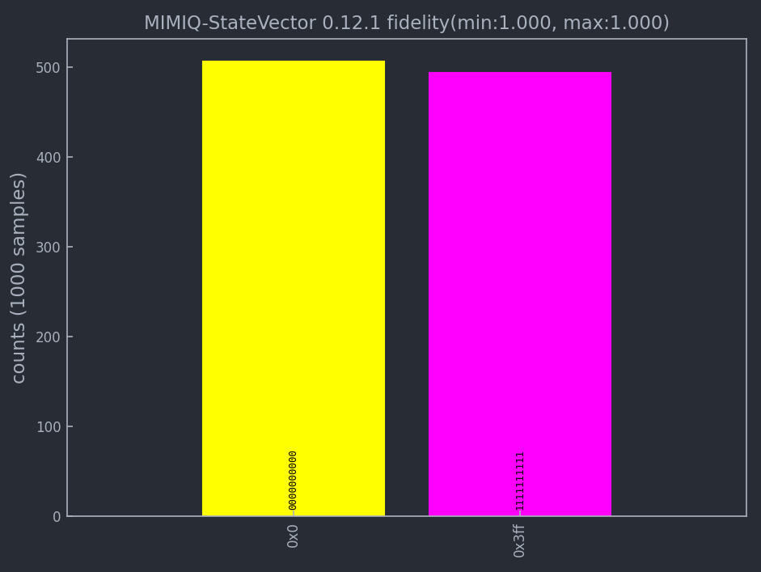

########
Tutorial
########

In this guide, we will walk you through the fundamental procedures for simulating a quantum circuit using MIMIQ-CIRC 
product developed by QPerfect. Throughout the tutorial, we will furnish links to detailed documentation and examples 
that can provide a deeper understanding of each topic.

In order to use MIMIQ-CIRC Python version, you need to first install the `mimiqcircuits` Python module within your workspace by following this step:

.. code:: python

  from mimiqcircuits import *

Building a Quantum circuit
==========================

The first step in executing quantum algorithm on MIMIQ-CIRC always 
consists in defining one implementation of the algorithm as a quantum circuit, 
a sequence of quantum operations (quantum gates, measurements, resets, etc...) 
that act on a set of qubits. In MIMIQ-CIRC we always start by defining an empty circuit:

.. code:: python
  
  circuit = Circuit()

.. code:: python

  circuit
  empty circuit

In :file:`mimiq-circuits-python` we do not need to specify the number of qubits of a circuit, 
or a list of quantum registers to use. Qubits will be allocated up to the maximum used index 
It's important to note that in :file:`mimiq-circuits-python`, qubit indices start from 0, following the standard Python indexing convention. 
Therefore, qubit indices are allowed values between 0 and 2^63.

A circuit is made up of quantum operations. Gates, or unitary operations, 
are the simplest and most common ones. Lists are provided by the documentation of 
:file:`mimiq-circuits-python`. Please check out in the :class:`~mimiqcircuits.Circuit` class for more details about available operations. 

To add operations to circuits in Python we will be using the :meth:`~mimiqcircuits.Circuit.push` function, which takes multiple arguments, 
but usually: the circuit to add the operation to, the operation to be added, and as many target qubits as possible.

In this first simple example [mimiqcircuits.GateH], only needs one target:

.. code:: python
  
  circuit.push(GateH(),0)

.. code::
  
  1-qubit circuit with 1 instructions:
  └── H @ q0

The text representation H @ q1 informs us that there is 
an instruction which applies the Hadamard gate to the qubit of index 0.

Multiple gates can be added at once through the same `push` syntax. 
In the following example we add 9 CX or control-X gates between the qubit 0 and all the qubits from 1 to 9.

.. code:: python

  circuit.push(GateCX(),0, range(1,10))

.. code::
  
  10-qubit circuit with 10 instructions:
  ├── H @ q0
  ├── CX @ q0, q1
  ├── CX @ q0, q2
  ├── CX @ q0, q3
  ├── CX @ q0, q4
  ├── CX @ q0, q5
  ├── CX @ q0, q6
  ├── CX @ q0, q7
  ├── CX @ q0, q8
  └── CX @ q0, q9

This syntax is not dissimilar to the OpenQASM one, and can be seen as equivalent of:

.. code:: python

  for i in range(1,10):
    circuit.push(GateCX(), 0, i)

The same is true for adding operations that act also on classical bits

.. code:: python

  circuit.push(Measure(),range(0,10), range(0,10))
  
.. code::
  
 10-qubit circuit with 20 instructions:
  ├── H @ q0
  ├── CX @ q0, q1
  ├── CX @ q0, q2
  ├── CX @ q0, q3
  ├── CX @ q0, q4
  ├── CX @ q0, q5
  ├── CX @ q0, q6
  ├── CX @ q0, q7
  ├── CX @ q0, q8
  ├── CX @ q0, q9
  ├── Measure @ q0, c0
  ├── Measure @ q1, c1
  ├── Measure @ q2, c2
  ├── Measure @ q3, c3
  ├── Measure @ q4, c4
  ├── Measure @ q5, c5
  ├── Measure @ q6, c6
  ├── Measure @ q7, c7
  ├── Measure @ q8, c8
  └── Measure @ q9, c9

which is equivalent to:

.. code:: python

  for i in range(0,10):
    circuit.push(Measure(), i, i)

The number of quantum bits and classical bits of a circuit is defined by the maximum index used, so in this case 10 for both.

.. code:: python

  circuit.num_bits(),  circuit.num_qubits()

With these informations, it is already possible to build any quantum circuit. 
However, for alternative advanced circuit building utilities see the documentation of :file:`mimiqcircuits-python` in this page :ref:`API References <mimiqcircuits-module>`.

Remote execution on MIMIQ-CIRC
==============================

In order to execute the implemented circuit on MIMIQ-CIRC three more steps are required:

* **Make a connection**: opening a connection to the MIMIQ Remote Services,

* **Send a Circuit to be executed**: send a circuit for execution,
  
* **Retrieve the results**: retrieve the results of the execution.

Connecting to MIMIQ
===================

In most cases, connecting to MIMIQ can achieved by a single instruction:

.. code:: python

  conn = MimiqConnection()

  conn.connect()

Now, you will be redirected to a local webpage, which will automatically open in your default browser. 
Here, you'll be prompted to enter your authentication username and password. 
After providing your authentication details you will be able to send jobs.

.. Note::

  In order to complete this step you need an active subscription to MIMIQ-CIRC. To obtain one, please `contact us 
  <https://qperfect.io/index.php/contact/>`__   or, 
  if your organization already has a subscription, contact the organization account holder.

executing a Circuit on MIMIQ
=============================

Once a connection is established an execution can be sent to the remote services.

.. code:: python

  job = conn.execute(circuit)

.. code:: 

  job

 '657b1a76d263121c8649f715'

This will execute a simulation of the given circuit with default parameters. 
The default choice of algorithm is "auto". Generally, there are three available options:

* **auto** for the automatically selecting the best algorithm according to circuit size and complexity.
* **statevector**  for a highly optimized state vector engine.
* **mps** for a large-scale Matrix Product States (MPS) method.

Please check out :class:`~mimiqcircuits.MimiqConnection` class for more details.

Retrieving execution results
============================

Once the execution has terminated on MIMIQ, the results can be retrieved via the :meth:`~mimiqcircuits.MimiqConnection.get_results` function, 
which returns a :class:`~mimiqcircuits.QCSResults` structure.

.. code:: python

  res = conn.get_results(job)

.. code:: 

  res

  QCSResults:
  ├── simulator: MIMIQ-StateVector 0.12.1
  ├── amplitudes time: 1.18e-07s
  ├── apply time: 7.8685e-05s
  ├── total time: 0.01071431s
  ├── sample time: 0.000524353s
  ├── compression time: 1.7545e-05s
  ├── fidelity estimate (min,max): (1.000, 1.000)
  ├── average ≥2-qubit gate error (min,max): (0.000, 0.000)
  ├── 1 executions
  ├── 0 amplitudes
  └── 1000 samples

Name and version of the simulator, samples, and timings can be retrieved from the aggregated results. 
For example, to make an histogram out of the retrieved samples, it suffices to execute

.. code:: python

  res.histogram()
  {frozenbitarray('1111111111'): 494, frozenbitarray('0000000000'): 506}

And for plotting the results simply execute this command:

.. code:: bash

  plothistogram(res)

Retrieving execsubmitted remote jobs
====================================

There is also possibility to retrieve your submitted jobs parameters:

.. code:: 

  circuit, parameters = conn.get_inputs(job)

.. code:: 

  circuit

  10-qubit circuit with 20 instructions:
  ├── H @ q0
  ├── CX @ q0, q1
  ├── CX @ q0, q2
  ├── CX @ q0, q3
  ├── CX @ q0, q4
  ├── CX @ q0, q5
  ├── CX @ q0, q6
  ├── CX @ q0, q7
  ├── CX @ q0, q8
  ├── CX @ q0, q9
  ├── Measure @ q0, c0
  ├── Measure @ q1, c1
  ├── Measure @ q2, c2
  ├── Measure @ q3, c3
  ├── Measure @ q4, c4
  ├── Measure @ q5, c5
  ├── Measure @ q6, c6
  ├── Measure @ q7, c7
  ├── Measure @ q8, c8
  └── Measure @ q9, c9

.. code:: 
  
  parameters

  {'executor': 'Circuits',
  'timelimit': 300,
  'files': [{'name': 'circuit.pb',
    'hash': '6624a5fea70bc461cbb9138a9de5e0c58baffe7fac4884b6b0bfc068b36ec388'}],
  'parameters': {'algorithm': 'auto',
    'bitstrings': [],
    'samples': 1000,
    'seed': 122635094871933542,
    'apilang: ': 'python',
    'apiversion': '0.6.1',
    'circuitsapiversion': '0.6.1',
    'bondDimension': 256}}

